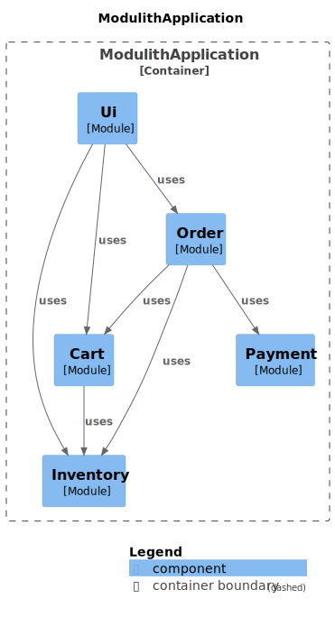

# T2-Modulith

The T2-Modulith is an implementation of the [T2-Project](https://t2-documentation.readthedocs.io/) as a monolith.
It has still a modular structure enforced by [Spring Modulith](https://spring.io/projects/spring-modulith).

**Migration from the microservices implementation to the monolith implementation:**

|                        Microservice                        |      Monolith      | Comment                                                                                                                                              |
|:----------------------------------------------------------:|:------------------:|------------------------------------------------------------------------------------------------------------------------------------------------------|
|         [Cart](https://github.com/t2-project/cart)         |    Cart Module     |                                                                                                                                                      |
|    [Inventory](https://github.com/t2-project/inventory)    |  Inventory Module  |                                                                                                                                                      |
|        [Order](https://github.com/t2-project/order)        |    Order Module    |                                                                                                                                                      |
|      [Payment](https://github.com/t2-project/payment)      |   Payment Module   |                                                                                                                                                      |
|           [UI](https://github.com/t2-project/ui)           |     UI Module      |                                                                                                                                                      |
|   [UI Backend](https://github.com/t2-project/uibackend)    |         ❌          | no API gateway needed anymore<br/> → REST endpoints are now located in the respective domain-specific module                                         |
| [Orchestrator](https://github.com/t2-project/orchestrator) |         ❌          | Saga Pattern not needed anymore                                                                                                                      |
|       [common](https://github.com/t2-project/common)       |         ❌          | jar was used by all microservices for inter-service communication<br/> → not relevant anymore; some parts moved to respective domain-specific module |

## Quick start

You can run T2-Modulith with all dependencies without building anything by using the existing Docker images from [DockerHub](https://hub.docker.com/r/t2project/modulith) and Docker Compose:

```sh
docker compose up
```

## Usage

You can use the application either by accessing the UI or by using the HTTP endpoints.

- UI: http://localhost:8081/ui/
- API: http://localhost:8081/swagger-ui/index.html

On how to use the UI see the usage section of the [T2-Project UI repository](https://github.com/t2-project/ui#usage).
How to use the API is described below in section [HTTP Endpoints](#http-endpoints).

## Build & Run

There are different ways on how to build and run the application. 

### Build with Maven and Docker

Application gets build by Maven first, then packaged into a Docker image and finally executed.

```sh
./mvnw clean install -DskipTests
docker build -t t2project/modulith:main .
docker compose up
```

### Build inside Docker

A multi-stage Dockerfile is used to build the application and place it into a smaller Docker image used for running it.

```sh
docker build -t t2project/modulith:main -f Dockerfile.full-build .
docker compose up
```

### Run in development mode

Development mode means that you run the Modulith application on your own e.g. in debugging mode using your IDE and only run the dependencies (databases and fake credit institute) with Docker.

```sh
docker compose -f docker-compose-dev.yml up
```

---

## Architecture



### Cart Module

The cart module manages the shopping carts of the T2-Project.
The content of a user's shopping cart is a map of Strings to Integers.
Within the context of the T2-Project it contains which products (identified by their id) and how many units there of a users wants to buy.

### Inventory Module

The inventory module is the inventory of the T2-Project.
It manages the products and reservations.

The products are the teas that the store sells and reservations exist to express that a user plans to buy some units of a product.

### Order Module

The order module is responsible for saving orders to the database and handling the completion of orders (trigger payment, committing reservations, deleting cart).

### Payment Module

The payment module is responsible for contacting the payment provider.

In a more real situation, a payment service would contact different payment providers, e.g. paypal or a certain credit institute based on which payment method a user chose.
However, here the payment module knows only one payment provider and always contact that one.

The default payment provider is the fake [Credit Institute Service](https://github.com/t2-project/creditinstitute).

### UI Module

The UI module provides a simple website. It is based on the UI of the original [TeaStore](https://github.com/DescartesResearch/TeaStore) and implemented with JSP.
The UI module communicates with the other modules directly by inter-process communication. The REST endpoints provided by the other modules are not used.

---

## HTTP Endpoints

The modules `cart`, `inventory` and `order` provide REST endpoints for their specific domain.
The JSP-specific http endpoints provided by the `ui` module are not listed here.

**Cart Module:**

* `/cart/{id}` GET list of all products in cart of a specific session
* `/cart/{id}` POST list of products to add/remove to/from cart of a specific session

**Inventory Module:**

* `/products` GET list of all products in the inventory
* `/inventory/{id}` : PUT, POST, GET or DELETE the product with productId `id`
* `/inventory/reservation` : POST to add a new reservation
* `/generate` : GET to generate new products
* `/restock` : GET to restock all items

**Order Module:**

* `/confirm` POST to place an order

### API Usage Examples

Base URL: `http://localhost:8081/`

#### Access the products / inventory

Endpoint to get all products is `GET /products/`:

```sh
curl http://localhost:8081/products/
```

Response:

```json5
[
    {"id":"609a96a806573c12ed34479f","name":"Earl Grey (loose)","description":"very nice Earl Grey (loose) tea","units":529,"price":2.088258409676226},
// [...]
    {"id":"609a96a906573c12ed3447ad","name":"Sencha (25 bags)","description":"very nice Sencha (25 bags) tea","units":101,"price":0.6923181656954707}
]
```

There are more REST endpoints automatically provided by Spring Data to access inventory items...

An explanatory request to get the inventory item with id "foo":

```sh
curl http://localhost:8081/inventory/foo
```

Response:

```json
{
  "name" : "Darjeeling (loose)",
  "description" : "very nice Darjeeling (loose) tea",
  "units" : 264,
  "price" : 1.6977123432245298,
  "reservations" : [ ],
  "_links" : {
    "self" : {
      "href" : "http://localhost:8081/inventory/foo"
    },
    "inventory" : {
      "href" : "http://localhost:8081/inventory/foo"
    }
  }
}
```

#### Restocking the Inventory

If all items are sold out, this is how you restock all of them.

```sh
curl http://localhost:8081/restock
```

If there are no products in the inventory (not as in '0 units of a product' but as in 'there is no product at all'), do this to generate new products.

```sh
curl http://localhost:8081/generate
```

#### Get the products in your cart

The cart is linked to a session id. Request to get the cart for the session id `bar`:

```sh
curl -b keks http://localhost:8081/cart/bar
```

Response:

```json
[{"id":"609a96a906573c12ed3447a8","name":"Ceylon (20 bags)","description":"very nice Ceylon (20 bags) tea","units":13,"price":3.593564279221348}]
```

#### Update the cart

Add product with id `foo` with 3 units to cart of session with id `bar`:

```sh
curl -i -X POST -H "Content-Type:application/json" -d '{"content":{"foo":3}}'  http://localhost:8081/cart/bar
```

Response:

```json
[{"id":"foo","name":"Darjeeling (loose)","description":"very nice Darjeeling (loose) tea","units":2147483644,"price":1.6977123432245298}]
```

Remove product with id `foo` from cart of session with id `bar`:

```sh
curl -i -X POST -H "Content-Type:application/json" -d '{"content":{"foo":-3}}'  http://localhost:8081/cart/bar
```

Response:

```json
[]
```

#### Add a Reservation

Reserve 3 units of product "foo" for user "bar" (a product with that id must indeed be in the store):

```sh
curl -i -X POST -H "Content-Type:application/json" -d '{ "productId" : "foo", "sessionId" : "bar", "units" : 3}' http://localhost:8081/inventory/reservation
```

If the reservation succeeds, the reply contains the product with `units` being the reserved units.

```json
{
    "id":"foo",
    "name":"Sencha (25 bags)",
    "description":"very nice Sencha (25 bags) tea",
    "units":98,
    "price":0.6923181656954707
}
```

#### Confirm Order

With this, you place an order for the user "foo", with the given payment details.

```sh
curl -i -X POST -H "Content-Type:application/json" -d '{"cardNumber":"num","cardOwner":"own","checksum":"sum", "sessionId":"foo"}' http://localhost:8081/confirm
```

---

## Application Properties

Property files: `./src/main/resources/application-*.yaml`

**T2 configuration:**

| property                      | read from env var             | description                                                                                     |
|-------------------------------|-------------------------------|-------------------------------------------------------------------------------------------------|
| t2.cart.TTL		                 | T2_CART_TTL                   | time to live of items in cart (in seconds)                                                      |
| t2.cart.taskRate	             | T2_CART_TASKRATE              | rate at which the cart checks for items that exceeded their TTL (in milliseconds)               |
| t2.inventory.size             | INVENTORY_SIZE                | number of items to be generated into the inventory repository on start up                       |
| t2.inventory.TTL              | T2_INVENTORY_TTL              | time to live of reservations (in seconds)                                                       |
| t2.inventory.taskRate         | T2_INVENTORY_TASKRATE         | rate at which the inventory checks for reservations that exceeded their TTL (in milliseconds).  |
| t2.payment.provider.dummy.url | T2_PAYMENT_PROVIDER_DUMMY_URL | url of the payment provider.                                                                    |
| t2.payment.provider.timeout   | T2_PAYMENT_PROVIDER_TIMEOUT   | timeout in seconds. the payment service waits this long for an reply from the payment provider. |

Setting either `TTL` or `taskrate` to a value less or equal to zero disables the collection of expired entries (cart module and inventory module).

**Postgres database:**

| property                            | read from env var                   | description                                      |
|-------------------------------------|-------------------------------------|--------------------------------------------------|
| spring.datasource.url               | SPRING_DATASOURCE_URL               |                                                  |
| spring.datasource.username          | SPRING_DATASOURCE_USERNAME          |                                                  |
| spring.datasource.password          | SPRING_DATASOURCE_PASSWORD          |                                                  |
| spring.datasource.driver-class-name | SPRING_DATASOURCE_DRIVER_CLASS_NAME | Should be usually set to `org.postgresql.Driver` |

**MongoDB database:**

| property                | read from env var | description          |
|-------------------------|-------------------|----------------------|
| spring.data.mongodb.uri | MONGO_HOST        | host of the mongo db |

---

## Technical Notes

- The application gets packaged as a war and not as jar, because of the limitations of JSP used for the UI (see Spring Docs about [JSP Limitations](https://docs.spring.io/spring-boot/docs/current/reference/html/web.html#web.servlet.embedded-container.jsp-limitations))
- Default port is set to 8081 to have the same base URL than the [T2-Project UI Backend Service](https://github.com/t2-project/uibackend)
